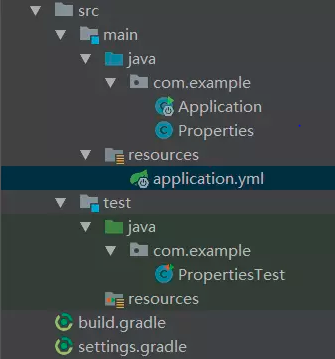
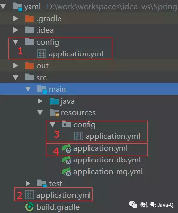

## Spring boot: YAML 属性配置文件详解

This page source from [深入Spring Boot (四)：YAML属性配置文件使用详解](https://mp.weixin.qq.com/s/zzNo5tTR9OIhcYi8-x-kog)

源代码请参考：[spring-boot-configuration-yaml](spring-boot-common/spring-boot-configuration-yaml)

Spring Boot弱化配置的特性让属性配置文件的使用也更加便捷，它默认支持对application.properties
或application.yml属性配置文件处理，即在application.properties或application.yml文件中添加属性配置，
可以使用@Value注解将属性值注入到beans中，或使用@ConfigurationProperties注解将属性值绑定到结构化的beans中，
本篇将详细介绍YAML属性配置文件的使用。

本篇主要包含以下6部分内容：

- YAML是什么 ；

- 基础使用；

- 对列表元素的支持 ；

- 多环境支持 ；

- 加载更多配置 ；

- 配置文件优先级。

### 1.YAML是什么
YAML是JSON的一个超集，是一种方便的定义层次配置数据的格式，结构层次上清晰明了，配置简单易读、易用。
要想使用YAML作为属性配置文件，需要将SnakeYAML库添加到classpath下，
Spring Boot对SnakeYAML库也做了集成，例如使用spring-boot-starter-web或spring-boot-starter都会自动添加SnakeYAML库到classpath下。
下面是一个简单的application.yml属性配置文件。
```yaml
server:
    display:
        name: app
    address: 192.168.1.1
```
yml和xml相比，少了一些结构化的代码，使数据更直接，一目了然。
yml和json呢？没有谁好谁坏，合适才是最好的。yml的语法比json优雅，注释更标准，适合做配置文件。json作为一种机器交换格式比yml强，更适合做api调用的数据交换。

### 2. YAML语法
以空格的缩进程度来控制层级关系。空格的个数并不重要，只要左边空格对齐则视为同一个层级。注意不能用tab代替空格。且大小写敏感。支持字面值，对象，数组三种数据结构，也支持复合结构。

**字面值**：字符串，布尔类型，数值，日期。字符串默认不加引号，单引号会转义特殊字符。日期格式支持yyyy/MM/dd HH:mm:ss

**对象**：由键值对组成，形如 key:(空格)value 的数据组成。冒号后面的空格是必须要有的，每组键值对占用一行，且缩进的程度要一致，也可以使用行内写法：{k1: v1, ....kn: vn}

**数组**：由形如 -(空格)value 的数据组成。短横线后面的空格是必须要有的，每组数据占用一行，且缩进的程度要一致，也可以使用行内写法： [1,2,...n]

**复合结构**：上面三种数据结构任意组合.

一个Spring Boot 的全局配置文件 application.yml，配置属性参数。主要有字符串，带特殊字符的字符串，布尔类型，数值，集合，行内集合，行内对象，集合对象这几种常用的数据格式。
```yaml
yaml:
  str: 字符串可以不加引号
  specialStr: "双引号直接输出\n特殊字符"
  specialStr2: '单引号可以转义\n特殊字符'
  flag: false
  num: 666
  Dnum: 88.88
  list:
    - one
    - two
    - two
  set: [1,2,2,3]
  map: {k1: v1, k2: v2}
  positions:
    - name: ITDragon
      salary: 15000.00
    - name: ITDragonBlog
      salary: 18888.88
```

### 3.在spring boot 中使用YAML

使用Spring Boot 2.0对上面的application.yml属性配置文件进行属性注入，对应的build.gradle文件内容如下：
```groovy
plugins {
    id 'java'
}
group 'spring-boot'
version '1.0-SNAPSHOT'
sourceCompatibility = 1.8
repositories {
    jcenter()
}

dependencies {
    compile("org.springframework.boot:spring-boot-starter:2.0.0.RELEASE")
    testCompile("org.springframework.boot:spring-boot-starter-test:2.0.0.RELEASE")
}
```
编写启动类Application.java，具体代码如下：
```java
@SpringBootApplication
public class Application {
    public static void main(String[] args) {
        SpringApplication.run(Application.class, args);
    }

}
```
编写要进行属性注入的bean，具体代码如下：
```java
@Component
public class Properties {
    @Value("${server.display.name}")
    private String serverDisplayName;
    @Value("${server.address}")
    private String serverAddress;
    //省略getter和setter
}
```
编写单元测试类PropertiesTest.java，具体代码如下：
```java
@RunWith(SpringRunner.class)
@SpringBootTest(webEnvironment = SpringBootTest.WebEnvironment.NONE)
public class PropertiesTest {

    @Autowired
    private Properties properties;
    @Test
    public void test() {
        System.out.println("server display name:" + properties.getServerDisplayName());
        System.out.println("server address:" + properties.getServerAddress());
    }

}
```
代码层次结构如下图所示： 


执行单元测试方法test，输出结果如下：

```javascript
server display name:app-1 
server address:127.0.0.1 
```
上面的单元测试类使用了@SpringBootTest注解，它是在1.4.0版本加入的单元测试辅助注解，
使用这个注解会在单元测试执行的时候自动搜索@SpringBootConfiguration注解标注的启动类，
进而启动Spring容器。@SpringBootTest注解的webEnvironment属性用于指定创建的ApplicationContext是否是WebApplicationContext，
默认值是WebEnvironment.MOCK，即创建WebApplicationContext.

### 3.对列表元素的支持
application.yml中有如下属性配置：
```yaml
server:
    name: app
    address:
        - 192.168.1.1
        - 192.168.1.2
```
这个属性配置中配置了一个address列表，可以使用@ConfigurationProperties注解进行属性注入，具体代码如下：
```java
@Component

@ConfigurationProperties(prefix = "server")

public class Properties {
    private String name;
    private List<String> address = new ArrayList<>();
    //省略getter和setter
}
```
列表元素在进行属性值注入的时候可以使用List或Set存储。
Spring Boot还支持复杂类型的列表元素，例如如下属性值配置：
```yaml
server:
    list:
      - name: app-1
        address:
            - 10.11.1.1
            - 10.11.1.2
      - name: app-2
        address:
            - 10.10.1.1
            - 10.10.1.2
```
上面配置了一个列表元素list，它包含了两个具体元素，在进行属性值注入的时需要编写如下bean：
```java
@Component

@ConfigurationProperties(prefix = "server")

public class Properties {
    private List<Server> list = new ArrayList<>();
    //省略getter和setter

}

public class Server {
    private String name;
    private List<String> address = new ArrayList<>();
    //省略getter和setter

}
```
### 4.多环境支持
像Properties配置文件一样，YAML配置文件也支持多环境切换，例如如下属性配置代码：
```yaml
server:
    name: app
    address:
        - 192.168.1.1
        - 192.168.1.2

spring:
  profiles:
    active: test
---

spring:
    profiles: dev
server:
    name: app-dev
    address:
        - 10.10.1.1
        - 10.10.1.2

---

spring:
    profiles: test
server:
    name: app-test
    address:
        - 192.100.1.1
        - 192.100.1.2

---
```
使用spring.profiles指定环境标识，例如dev环境、test环境。使用spring.profiles.active指定生效的环境配置，例如上面指定生效test环境的属性配置。

### 5.加载更多配置

项目的属性配置文件比较多的时候，会把它们按用途分为多个配置文件，例如application-db.yml、application-mq.yml等，Spring Boot也支持对这些文件的加载，除了使用spring.config.location实现，还可以在application.yml中添加spring.profiles.include属性实现，属性值有多个的使用逗号分隔，例如额外加载application-db.yml和application-mq.yml配置如下：
```yaml
spring:
  profiles:
    include: db,mq
```

### 6.配置文件优先级

以上对application.yml文件的使用都是基于在classpath根路径下，即将application.yml文件放在resources目录下。Spring Boot支持从以下位置加载application.yml文件：

- 当前目录下的/config子目录；
- 当前目录；
- classpath下的/config包；
- classpath根路径。

下面用一张图展示这四个位置。


若这四个位置都存在application.yml文件，属性值的覆盖顺序是：1>2>3>4，例如四个位置的application.yml文件都配置了db.name属性，最终生效的是当前目录下的/config子目录application.yml文件中的属性值；如果四个位置的application.yml文件，只有classpath下的/config包application.yml文件配置了db.name，最终生效的就是这个位置下的属性值。

### 7.指定激活指定的配置文件profile

- 可以在系统变量里面设置`spring.profiles.active=local`
```shell
$ java -jar -Dspring.profiles.active=production demo-0.0.1-SNAPSHOT.jar
```
- 可以在操作系统环境变量里面设置`SPRING_PROFILES_ACTIVE=dev`
``shell
set SPRING_PROFILES_ACTIVE=dev
``
- 当然也可以在**application.yml**里面指定
```yaml
spring:
  profiles:
    active: local
```

