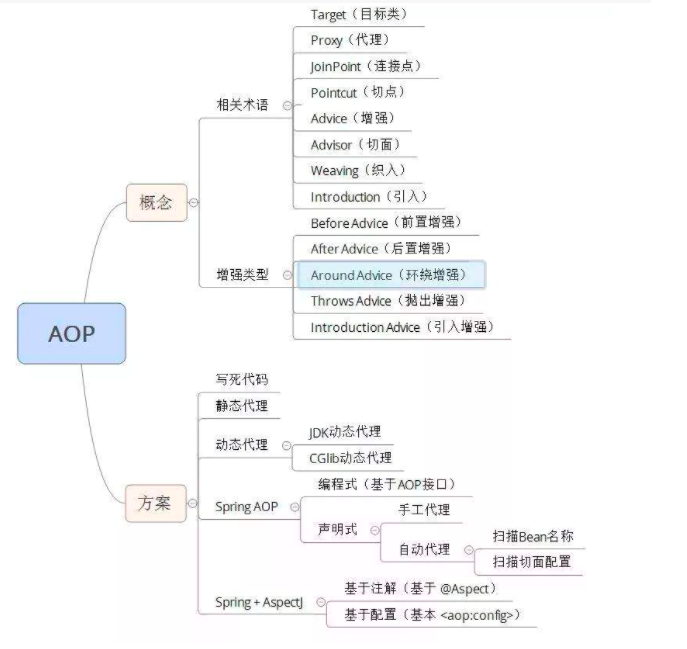
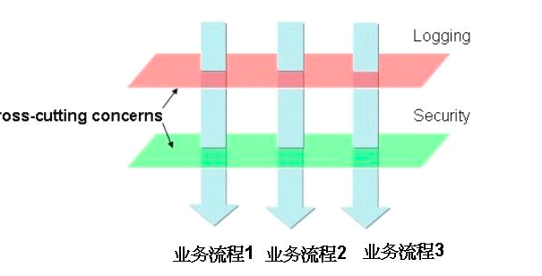
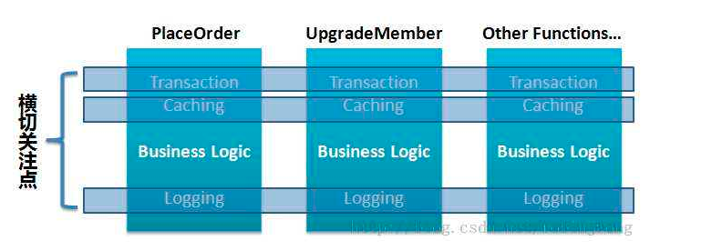

## Spring AOP 介绍

这里仅仅给出几个图片介绍Spring AOP,网上资料非常多,本文就简要参考[demo2_aop_logging](https://github.com/KotlinSpringBoot/demo2_aop_logging)中的相关介绍。

在运行时，动态地将代码切入到类的指定方法、指定位置上.

这样的编程思想就是面向切面的编程。

面向切面编程（AOP是Aspect Oriented Program的首字母缩写） ，我们知道，面向对象的特点是继承、多态和封装。而封装就要求将功能分散到不同的对象中去，这在软件设计中往往称为职责分配。

实际上也就是说，让不同的类设计不同的方法。这样代码就分散到一个个的类中去了。这样做的好处是降低了代码的复杂程度，使类可重用。

但是人们也发现，在分散代码的同时，也增加了代码的重复性。什么意思呢？比如说，我们在两个类中，可能都需要在每个方法中做日志。按面向对象的设计方法，我们就必须在两个类的方法中都加入日志的内容。也许他们是完全相同的，但就是因为面向对象的设计让类与类之间无法联系，而不能将这些重复的代码统一起来。

也许有人会说，那好办啊，我们可以将这段代码写在一个独立的类独立的方法里，然后再在这两个类中调用。但是，这样一来，这两个类跟我们上面提到的独立的类就有耦合了，它的改变会影响这两个类。那么，有没有什么办法，能让我们在需要的时候，随意地加入代码呢？这种在运行时，动态地将代码切入到类的指定方法、指定位置上的编程思想就是面向切面的编程。

一般而言，我们管切入到指定类指定方法的代码片段称为切面，而切入到哪些类、哪些方法则叫切入点。有了AOP，我们就可以把几个类共有的代码，抽取到一个切片中，等到需要时再切入对象中去，从而改变其原有的行为。这样看来，AOP其实只是OOP的补充而已。

OOP从横向上区分出一个个的类来，而AOP则从纵向上向对象中加入特定的代码。有了AOP，OOP变得立体了。如果加上时间维度，AOP使OOP由原来的二维变为三维了，由平面变成立体了。从技术上来说，AOP基本上是通过代理机制实现的。

AOP在编程历史上可以说是里程碑式的，对OOP编程是一种十分有益的补充。

最常见的一些横切行为如下面这些：

日志记录，跟踪，优化和监控 事务的处理 持久化 性能的优化 资源池，如数据库连接池的管理 系统统一的认证、权限管理等 应用系统的异常捕捉及处理 针对具体行业应用的横切行为

在软件业，AOP为Aspect Oriented Programming的缩写，意为：面向切面编程，通过预编译方式和运行期动态代理实现程序功能的统一维护的一种技术。AOP是OOP的延续，是软件开发中的一个热点，也是Spring框架中的一个重要内容，是函数式编程的一种衍生范型。利用AOP可以对业务逻辑的各个部分进行隔离，从而使得业务逻辑各部分之间的耦合度降低，提高程序的可重用性，同时提高了开发的效率。

在Spring中提供了面向切面编程的丰富支持，允许通过分离应用的业务逻辑与系统级服务（例如审计（auditing）和事务（transaction）管理）进行内聚性的开发。

主要功能:

日志记录，性能统计，安全控制，事务处理，异常处理等等。

OOP引入封装、继承、多态等概念来建立一种对象层次结构，用于模拟公共行为的一个集合。不过OOP允许开发者定义纵向的关系，但并不适合定义横向的关系，例如日志功能。日志代码往往横向地散布在所有对象层次中，而与它对应的对象的核心功能毫无关系对于其他类型的代码，如安全性、异常处理和透明的持续性也都是如此，这种散布在各处的无关的代码被称为横切（cross cutting），在OOP设计中，它导致了大量代码的重复，而不利于各个模块的重用。

AOP技术恰恰相反，它利用一种称为"横切"的技术，剖解开封装的对象内部，并将那些影响了多个类的公共行为封装到一个可重用模块，并将其命名为"Aspect"，即切面。所谓"切面"，简单说就是那些与业务无关，却为业务模块所共同调用的逻辑或责任封装起来，便于减少系统的重复代码，降低模块之间的耦合度，并有利于未来的可操作性和可维护性。

使用"横切"技术，AOP把软件系统分为两个部分：核心关注点和横切关注点。业务处理的主要流程是核心关注点，与之关系不大的部分是横切关注点。横切关注点的一个特点是，他们经常发生在核心关注点的多处，而各处基本相似，比如权限认证、日志、事物。AOP的作用在于分离系统中的各种关注点，将核心关注点和横切关注点分离开来。

AOP核心概念

1、横切关注点

对哪些方法进行拦截，拦截后怎么处理，这些关注点称之为横切关注点

2、切面（aspect）

类是对物体特征的抽象，切面就是对横切关注点的抽象

3、连接点（joinpoint）

被拦截到的点，因为Spring只支持方法类型的连接点，所以在Spring中连接点指的就是被拦截到的方法，实际上连接点还可以是字段或者构造器

4、切入点（pointcut）

对连接点进行拦截的定义

5、通知（advice）

所谓通知指的就是指拦截到连接点之后要执行的代码，通知分为前置、后置、异常、最终、环绕通知五类

6、目标对象

代理的目标对象

7、织入（weave）

将切面应用到目标对象并导致代理对象创建的过程

8、引入（introduction）

在不修改代码的前提下，引入可以在运行期为类动态地添加一些方法或字段

Spring对AOP的支持

Spring中AOP代理由Spring的IOC容器负责生成、管理，其依赖关系也由IOC容器负责管理。因此，AOP代理可以直接使用容器中的其它bean实例作为目标，这种关系可由IOC容器的依赖注入提供。Spring创建代理的规则为：

1、默认使用Java动态代理来创建AOP代理，这样就可以为任何接口实例创建代理了

2、当需要代理的类不是代理接口的时候，Spring会切换为使用CGLIB代理，也可强制使用CGLIB

AOP编程其实是很简单的事情，纵观AOP编程，程序员只需要参与三个部分：

1、定义普通业务组件

2、定义切入点，一个切入点可能横切多个业务组件

3、定义增强处理，增强处理就是在AOP框架为普通业务组件织入的处理动作

所以进行AOP编程的关键就是定义切入点和定义增强处理，一旦定义了合适的切入点和增强处理，AOP框架将自动生成AOP代理，即：代理对象的方法=增强处理+被代理对象的方法。

重温 AspectJ 中几个必须要了解的概念：

Aspect： Aspect 声明类似于 Java 中的类声明，在 Aspect 中会包含着一些 Pointcut 以及相应的 Advice。 Joint point：表示在程序中明确定义的点，典型的包括方法调用，对类成员的访问以及异常处理程序块的执行等等，它自身还可以嵌套其它 joint point。 Pointcut：表示一组 joint point，这些 joint point 或是通过逻辑关系组合起来，或是通过通配、正则表达式等方式集中起来，它定义了相应的 Advice 将要发生的地方。 Advice：Advice 定义了在 pointcut 里面定义的程序点具体要做的操作，它通过 before、after 和 around 来区别是在每个 joint point 之前、之后还是代替执行的代码。

下面要讨论的这些问题，也许正是接触了 AOP 之后所困惑的。

AOP 帮助我们解决了新的问题没有？

AOP 并没有帮助我们解决任何新的问题，它只是提供了一种更好的办法，能够用更少的工作量来解决现有的一些问题，并且使得系统更加健壮，可维护性更好。同时，它让我们在进行系统架构和模块设计的时候多了新的选择和新的思路。

实现AOP的切面主要有以下几个要素：

@Aspect： 将一个java类定义为切面类 @Pointcut：定义一个切入点（规则表达式）

根据需要在切入点不同位置的切入内容

@Before：在切入点开始处切入内容 @After：在切入点结尾处切入内容 @AfterReturning：在切入点return之后切入内容（返回值回调，可以用来对处理返回值做一些加工处理） @Around：在切入点前后切入内容，并自己控制何时执行切入点自身的内容 @AfterThrowing：用来处理当切入内容部分抛出异常之后的处理逻辑。

