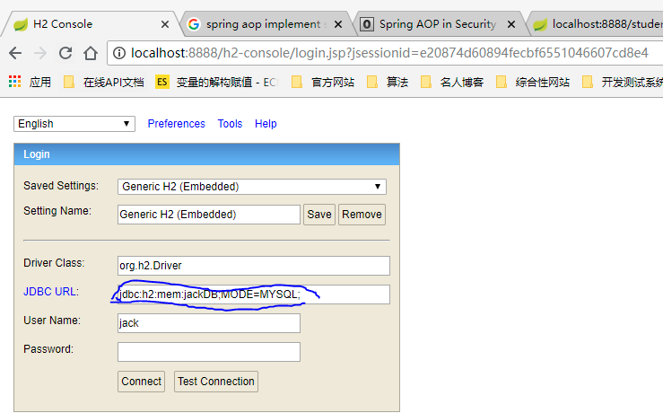
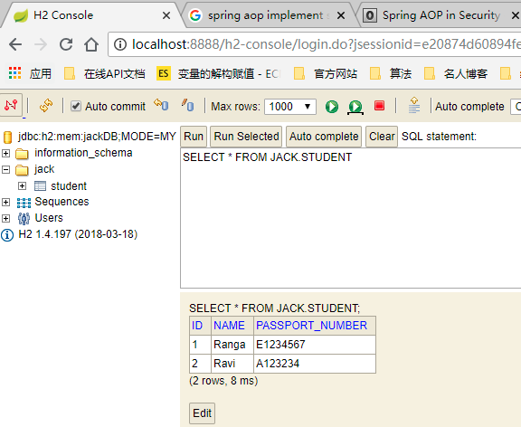
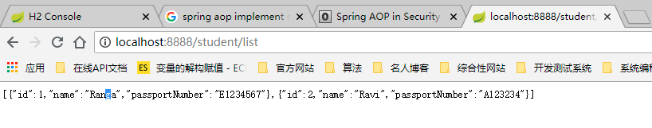

## Integrating Spring Boot and Spring JDBC with H2 and Starter JDBC

This guide will help you create a simple project with Spring Boot. You will add code to the project to connect to a database using Spring JDBC. You will learn to write all the CRUD methods.

### Starter Projects in pom.xml
Below is the list of starter projects in pom.xml.
```xml
<dependency>
    <groupId>org.springframework.boot</groupId>
    <artifactId>spring-boot-starter-jdbc</artifactId>
</dependency>
<dependency>
    <groupId>org.springframework.boot</groupId>
    <artifactId>spring-boot-starter-web</artifactId>
</dependency>

<dependency>
    <groupId>org.springframework.boot</groupId>
    <artifactId>spring-boot-devtools</artifactId>
    <scope>runtime</scope>
</dependency>

<dependency>
    <groupId>com.h2database</groupId>
    <artifactId>h2</artifactId>
    <scope>runtime</scope>
</dependency>
<dependency>
    <groupId>org.springframework.boot</groupId>
    <artifactId>spring-boot-starter-test</artifactId>
    <scope>test</scope>
</dependency>
```

### Initialize H2 in-memory database with the schema

We will use H2 as the database.

H2 provides a web interface called H2 Console to see the data. Let’s enable h2 console in the application.yml

/src/main/resources/application.yml

```yaml
server:
  port: 8888
spring:
    h2:
      ## web console address: http://localhost:8888/h2-console
      ## JDBC URL : jdbc:h2:mem:testdb;MODE=MYSQL; take care the same name with the spring.datasource.url 
      ## Once login use the schema.tablename to query 
      ## like select * from jack.student;
      console: true
      settings:
        web-allow-others: true
```
When you reload the application, you can launch up H2 Console at http://localhost:8888/h2-console.When you use the right JDBC URL given above, you should see an empty schema when you click Connect button. 



### execute SQL script on connection with H2.

The H2 database allows to execute SQL statement(s) within the connection. This comes handy if you are using the H2 database to test your Java Persistence queries.
```java
    String url = "jdbc:h2:mem:test;INIT=runscript from '~/create.sql`\\;runscript from '~/init.sql'";
```

Please note the double backslash is only required in a Java or Properties file. In a GUI or in an XML file, only the one backslash is required. 
```xml
    <property name="url" value="jdbc:h2:mem:test;INIT=create schema if not exists test\;runscript from '~/sql/init.sql'"/>
```
And you could also take the classpath as the init file location. For instance you have in your Maven project in src/main/resources:
h2.properties
init.sql

h2.properties contain the JDBC settings:
```properties
user=admin
password=4321
driver=org.h2.Driver
url=jdbc:h2:~/demo;DB_CLOSE_DELAY=-1;AUTO_SERVER=TRUE;
testurl=jdbc:h2:~/test;INIT=RUNSCRIPT FROM 'classpath:init.sql';DB_CLOSE_DELAY=-1;AUTO_SERVER=TRUE;

```
In the testurl property, the init.sql is taken from the classpath. This can result in following example code:
```java
static final Connection connect(final String fileName, final boolean test) throws ClassNotFoundException, SQLException, IOException {
    Properties settings = new Properties();
    //establish database connection
    settings.load(new FileInputStream(fileName));
    Class.forName(settings.getProperty("driver"));
    String url = test ? settings.getProperty("testurl") : settings.getProperty("url");
    Connection conn = DriverManager.getConnection(url, settings.getProperty("user"), settings.getProperty("password"));
    return conn;
}
```
### Spring boot H2 configuration 
And based on the spring boot , we can do that much easier, only config the init script in the spring datasource url as below:
```yaml
spring:
    datasource:
      driver-class-name: org.h2.Driver
      username: jack
      password:
      ### url: jdbc:h2:mem:jackDB;MODE=MYSQL;INIT=CREATE SCHEMA IF NOT EXISTS JACK\;CREATE USER IF NOT EXISTS jack PASSWORD ''\;SET SCHEMA JACK;
      url: jdbc:h2:mem:jackDB;MODE=MYSQL;INIT=RUNSCRIPT FROM 'classpath:db/init_db.sql';DB_CLOSE_DELAY=-1;
```
Please refer to the sample project [spring-boot-spring-jdbc-h2](spring-boot-common/spring-boot-h2-usage/spring-boot-spring-jdbc-h2)

Once you bring up the application and login in to the H2 console, you will see 2 student records around the DB. 



The Rest api result from chromw: 




##### Reference 
- [Integrating Spring Boot and Spring JDBC with H2 and Starter JDBC](http://www.springboottutorial.com/spring-boot-and-spring-jdbc-with-h2)
- [EXCECUTE SQL ON CONNECTION WITH H2](https://cinhtau.net/2015/10/29/excecute-sql-on-connection-with-h2/)