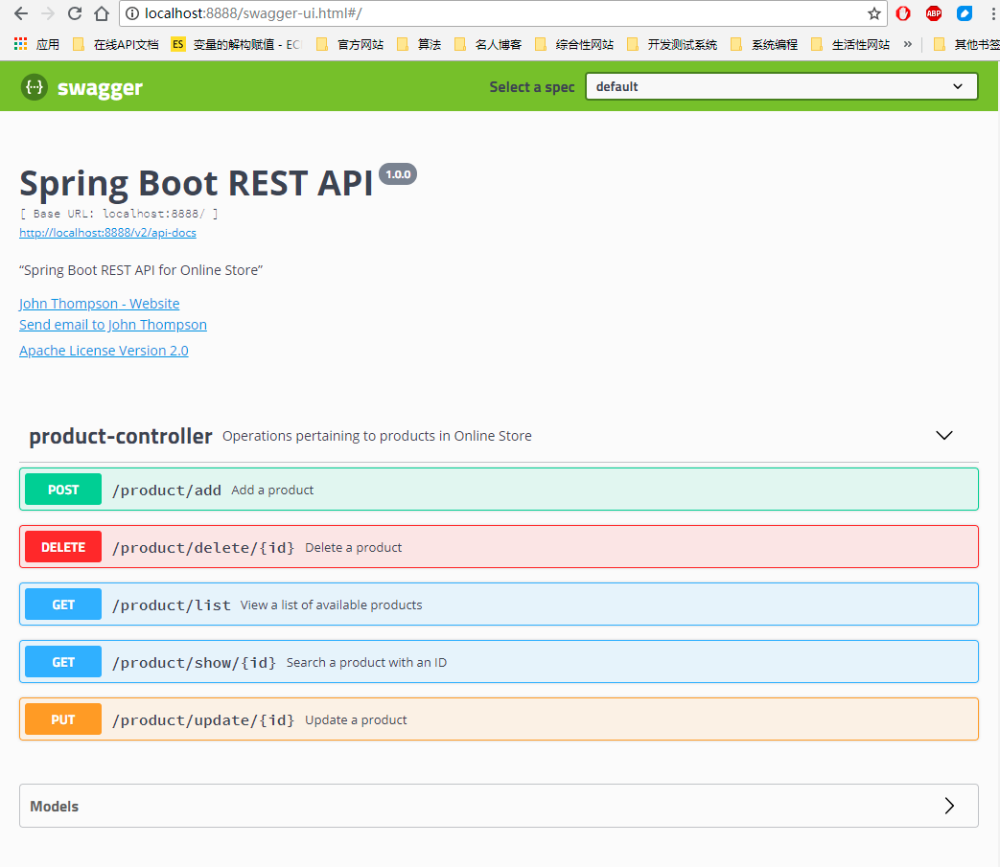
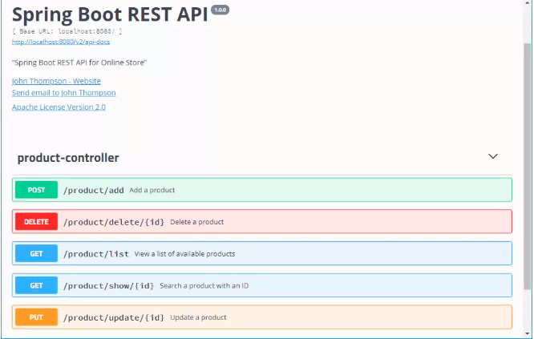
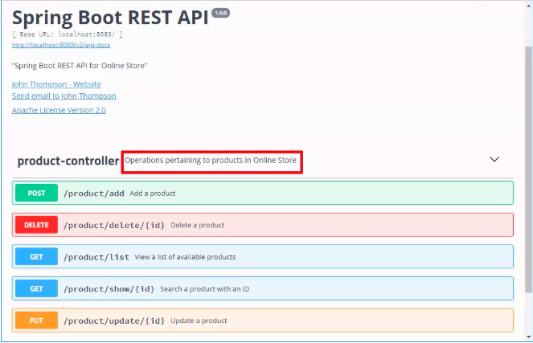
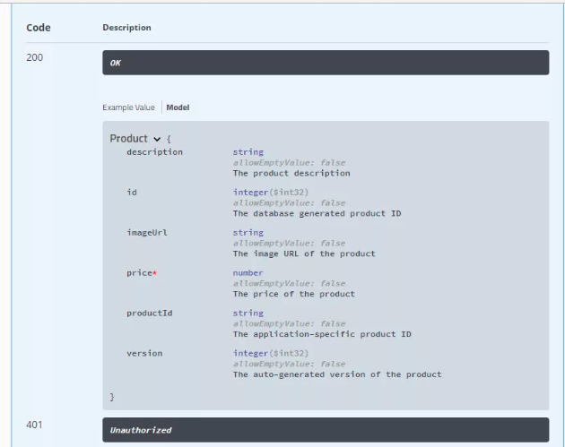

## SPRING BOOT RESTFUL API DOCUMENTATION WITH SWAGGER 2

This page source from [SPRING BOOT RESTFUL API DOCUMENTATION WITH SWAGGER 2](https://springframework.guru/spring-boot-restful-api-documentation-with-swagger-2/).

Source code refer to [spring-boot-swagger2-document](spring-boot-restApi/spring-boot-swagger2-document)

### Background 

Spring Boot makes developing RESTful services ridiculously easy. And using Swagger makes documenting your RESTful services easy.

Building a back-end API layer introduces a whole new area of challenges that goes beyond implementing just endpoints. You now have clients which will now be using your API. Your clients will need to know how to interact with your API. In SOAP based web services, you had a WSDL to work with. This gave API developers a XML based contract, which defined the API. However, with RESTFul web services, there is no WSDL. Thus your API documentation becomes more critical.

API documentation should be structured so that it’s informative, succinct, and easy to read. But best practices on, how you document your API, its structure, what to include and what not to is altogether a different subject that I won’t be covering here. For best practices on documentation, I suggest going through this [presentation of Andy Wikinson](https://www.infoq.com/presentations/doc-restful-api).

In this post I’ll cover how to use [Swagger 2](http://swagger.io/) to generate REST API documentation for a Spring Boot 2.0 project.

### Swagger 2 in Spring Boot

Swagger 2 is an open source project used to describe and document RESTful APIs. Swagger 2 is language-agnostic and is extensible into new technologies and protocols beyond HTTP. The current version defines a set HTML, JavaScript, and CSS assets to dynamically generate documentation from a Swagger-compliant API. These files are bundled by the Swagger UI project to display the API on browser. Besides rendering documentation, Swagger UI allows other API developers or consumers to interact with the API’s resources without having any of the implementation logic in place.

The Swagger 2 specification, which is known as [OpenAPI specification](https://github.com/OAI/OpenAPI-Specification/blob/master/versions/2.0.md) has several implementations. Currently, [Springfox](https://springfox.github.io/springfox/) that has replaced Swagger-SpringMVC (Swagger 1.2 and older) is popular for Spring Boot applications. Springfox supports both Swagger 1.2 and 2.0.

We will be using Springfox in our project.
To bring it in, we need the following dependency declaration in our Maven POM.
```xml
<dependency>
    <groupId>io.springfox</groupId>
    <artifactId>springfox-swagger2</artifactId>
    <version>2.8.0</version>
    <scope>compile</scope>
</dependency>
```
In addition to Sprinfox, we also require Swagger UI. The code to include Swagger UI is this.
```xml
<dependency>
    <groupId>io.springfox</groupId>
    <artifactId>springfox-swagger-ui</artifactId>
    <version>2.8.0</version>
    <scope>compile</scope>
</dependency>
```

### The Spring Boot RESTful Application
Our application implements a set of REST endpoints to manage products. 
We have a Product domain entity and a repository named ProductRepository that mock the DAO. 
The service layer is composed of a ProductService interface and a ProductServiceImpl implementation class.

The controller of the application , ProductController defines the REST API endpoints. The code of ProductController is this.
```java
@RestController
@RequestMapping("/product")
public class ProductController {
 
    private ProductService productService;
 
    @Autowired
    public void setProductService(ProductService productService) {
        this.productService = productService;
    }
 
   
    @RequestMapping(value = "/list", method= RequestMethod.GET)
    public Iterable list(Model model){
        Iterable productList = productService.listAllProducts();
        return productList;
    }
   
    @RequestMapping(value = "/show/{id}", method= RequestMethod.GET)
    public Product showProduct(@PathVariable Integer id, Model model){
       Product product = productService.getProductById(id);
        return product;
    }
 
 
    @RequestMapping(value = "/add", method = RequestMethod.POST)
    public ResponseEntity saveProduct(@RequestBody Product product){
        productService.saveProduct(product);
        return new ResponseEntity("Product saved successfully", HttpStatus.OK);
    }
 
 
    @RequestMapping(value = "/update/{id}", method = RequestMethod.PUT)
    public ResponseEntity updateProduct(@PathVariable Integer id, @RequestBody Product product){
        Product storedProduct = productService.getProductById(id);
        storedProduct.setDescription(product.getDescription());
        storedProduct.setImageUrl(product.getImageUrl());
        storedProduct.setPrice(product.getPrice());
        productService.saveProduct(storedProduct);
        return new ResponseEntity("Product updated successfully", HttpStatus.OK);
    }
 
  
    @RequestMapping(value="/delete/{id}", method = RequestMethod.DELETE)
    public ResponseEntity delete(@PathVariable Integer id){
        productService.deleteProduct(id);
        return new ResponseEntity("Product deleted successfully", HttpStatus.OK);
 
    }
 
}
```
In this controller, the `@RestController` annotation introduced in Spring 4.0 marks `ProductController` as a REST API controller. Under the hood, `@RestController` works as a convenient annotation to annotate the class with the `@Controller` and `@ResponseBody`.

### Configuring Swagger 2 in the Application

For our application, we will create a Docket bean in a Spring Boot configuration to configure Swagger 2 for the application. A Springfox Docket instance provides the primary API configuration with sensible defaults and convenience methods for configuration. Our Spring Boot configuration class, SwaggerConfig is this.
```java
@Configuration
@EnableSwagger2
public class SwaggerConfig extends WebMvcConfigurationSupport {
    @Bean
    public Docket productApi() {
        return new Docket(DocumentationType.SWAGGER_2)
                .select()                 .apis(RequestHandlerSelectors.basePackage("com.github.fangming.springboot"))
                .paths(regex("/product.*"))
                .build();
             
    }
  @Override
    protected void addResourceHandlers(ResourceHandlerRegistry registry) {
        registry.addResourceHandler("swagger-ui.html")
                .addResourceLocations("classpath:/META-INF/resources/");
 
        registry.addResourceHandler("/webjars/**")
                .addResourceLocations("classpath:/META-INF/resources/webjars/");
    }
}
```
There are some breaking changes in Spring Boot 2 with Swagger 2 which affect the auto configuration of Swagger UI. To configure support for Swagger UI with Spring Boot 2, you need to extend the class WebMvcConfigurationSupport and add two resource handlers.

In this configuration class, the `@EnableSwagger2` annotation enables Swagger support in the class. The `select()` method called on the Docket bean instance returns an `ApiSelectorBuilder`, which provides the apis() and paths() methods to filter the controllers and methods being documented using String predicates. In the code, the `RequestHandlerSelectors`.basePackage predicate matches the `com.github.fangming.springboot.controller` base package to filter the API. The regex parameter passed to paths() acts as an additional filter to generate documentation only for the path starting with `/product`.

At this point, you should be able to test the configuration by starting the app and pointing your browser to `http://localhost:8888/v2/api-docs`.

Obviously, the above JSON dump that Swagger 2 generates for our endpoints is not something we want.

What we want is some nice human readable structured documentation, and this is where Swagger UI takes over.

On pointing your browser to http://localhost:8888/swagger-ui.html, you will see the generated documentation rendered by Swagger UI, like this.


As you can see, Swagger 2 used sensible defaults to generate documentation of our `ProductController` .

Then Swagger UI wrapped everything up to provide us an intuitive UI. This was all done automatically. We did not write any code or other documentation to support Swagger.

### Customizing Swagger
So far, we’ve been looking at Swagger documentation, as it comes out of the box. But Swagger 2 has some great customization options.

Let’s start customizing Swagger by providing information about our API in the `SwaggerConfig` class like this.
```java
import org.springframework.context.annotation.Bean;
import org.springframework.context.annotation.Configuration;
import org.springframework.web.servlet.config.annotation.ResourceHandlerRegistry;
import org.springframework.web.servlet.config.annotation.WebMvcConfigurationSupport;
import springfox.documentation.builders.ApiInfoBuilder;
import springfox.documentation.builders.RequestHandlerSelectors;
import springfox.documentation.service.ApiInfo;
import springfox.documentation.service.Contact;
import springfox.documentation.spi.DocumentationType;
import springfox.documentation.spring.web.plugins.Docket;
import springfox.documentation.swagger2.annotations.EnableSwagger2;
import static springfox.documentation.builders.PathSelectors.regex;
 
@Configuration
@EnableSwagger2
public class SwaggerConfig extends WebMvcConfigurationSupport {
    @Bean
    public Docket productApi() {
        return new Docket(DocumentationType.SWAGGER_2)
                .select()
                .apis(RequestHandlerSelectors.basePackage("guru.springframework.controllers"))
                .paths(regex("/product.*"))
                .build()
                .apiInfo(metaData());
    }
    private ApiInfo metaData() {
        return new ApiInfoBuilder()
                .title("Spring Boot REST API")
                .description("\"Spring Boot REST API for Online Store\"")
                .version("1.0.0")
                .license("Apache License Version 2.0")
                .licenseUrl("https://www.apache.org/licenses/LICENSE-2.0\"")
                .contact(new Contact("John Thompson", "https://springframework.guru/about/", "john@springfrmework.guru"))
                .build();
    }
    @Override
    protected void addResourceHandlers(ResourceHandlerRegistry registry) {
        registry.addResourceHandler("swagger-ui.html")
                .addResourceLocations("classpath:/META-INF/resources/");
 
        registry.addResourceHandler("/webjars/**")
                .addResourceLocations("classpath:/META-INF/resources/webjars/");
    }
}
```
In the `SwaggerConfig` class, we have added a `metaData()` method that returns and ApiInfo object initialized with information about our API. Line 23 initializes the `Docket` with the new information.

The Swagger 2 generated documentation, now look more details.

### Swagger 2 Annotations for REST Endpoints
At this point, if you click the product-controller link, Swagger-UI will display the documentation of our operation endpoints, like this.


For each of our operation endpoint, we can use the @ApiOperation annotation to describe the endpoint and its response type, like this:
We can use the @Api annotation on our ProductController class to describe our API.
```java
@RestController
@RequestMapping("/product")
@Api(value="onlinestore", description="Operations pertaining to products in Online Store")
public class ProductController {
.  . . .
}
```

The Swagger-UI generated documentation will reflect the description, and now looks like this.


Swagger 2 also allows overriding the default response messages of HTTP methods. You can use the @ApiResponse annotation to document other responses, in addition to the regular HTTP 200 OK, like this.

```java
@ApiOperation(value = "View a list of available products", response = Iterable.class)
@ApiResponses(value = {
        @ApiResponse(code = 200, message = "Successfully retrieved list"),
        @ApiResponse(code = 401, message = "You are not authorized to view the resource"),
        @ApiResponse(code = 403, message = "Accessing the resource you were trying to reach is forbidden"),
        @ApiResponse(code = 404, message = "The resource you were trying to reach is not found")
}
)
@RequestMapping(value = "/list", method= RequestMethod.GET, produces = "application/json")
public Iterable list(Model model){
    Iterable productList = productService.listAllProducts();
    return productList;
}
```
One undocumented thing that took quite some of my time was related to the value of Response Content Type. Swagger 2 generated "*/*", while I was expecting "application/json" for Response Content Type. It was only after updating the @RequestMapping annotation with produces = "application/json" that the desired value got generated. The annotated ProductController is this.

### Swagger 2 Annotations for Model
You can use the `@ApiModelProperty` annotation to describe the properties of the `Product` model. With `@ApiModelProperty`, you can also document a property as required.

The code of our `Product` class is this.
```java
public class Product {

    @ApiModelProperty(notes = "The database generated product ID")
    private Integer id;
    @ApiModelProperty(notes = "The auto-generated version of the product")
    private Integer version;
    @ApiModelProperty(notes = "The application-specific product ID")
    private String productId;
    @ApiModelProperty(notes = "The product description")
    private String description;
    @ApiModelProperty(notes = "The image URL of the product")
    private String imageUrl;
    @ApiModelProperty(notes = "The price of the product", required = true)
    private BigDecimal price;
  }
```
The Swagger 2 generated documentation for Product is this.


### Summary

Beside REST API documentation and presentation with Swagger Core and Swagger UI, Swagger 2 has a whole lot of other uses too that is beyond the scope of this post. One of my favorite is Swagger Editor, a tool to design new APIs or edit existing ones. The editor visually renders your Swagger definition and provides real time error-feedback. Another one is Swagger Codegen – a code generation framework for building Client SDKs, servers, and documentation from Swagger definitions.

Swagger 2 also supports Swagger definition through JSON and YAML files. It is something you should try if you want to avoid implementation-specific code in your codebase by externalizing them in JSON and YAML files – something that I will cover in a future post.