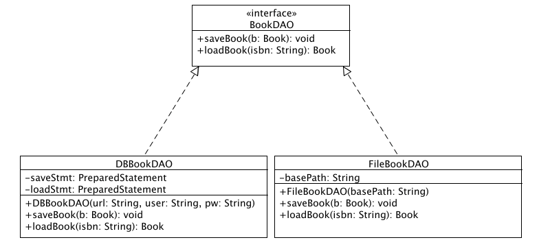

## Introduce to Data Access Object

This page roughly from this page: 
[Data Access Object](http://best-practice-software-engineering.ifs.tuwien.ac.at/patterns/dao.html)

One aspect of the business layer is the data access layer that connects the services with the database. Accessing data varies depending on the source of the data. Access to persistent data varies greatly depending on the type of storage (database, flat files, xml files, and so on) and it even differs from its implementation (for example different SQL-dialects).

The goal is to abstract and encapsulate all access to the data and provide an interface. This is called the Data Access Object pattern. In a nutshell, the DAO "knows" which data source (that could be a database, a flat file or even a WebService) to connect to and is specific for this data source (e.g. a OracleDAO might use oracle-specific data types, a WebServiceDAO might parse the incoming and outgoing message etc.).

From the applications point of view, it makes no difference when it accesses a relational database or parses xml files (using a DAO). The DAO is usually able to create an instance of a data object ("to read data") and also to persist data ("to save data") to the datasource.

To see the DAO pattern in action, look at the (heavily documented) class JdbcObjectStudentDAO in the basic example.

### Applicability / Uses

Use a Data Access Object when:

- you need to access a persistent storage more than one time, especially if you want to exchange the data source later.
- you want to separate a data resource's client interface from its data access mechanisms
- you want to adapt a specific data resource's access API to a generic client interface
- in a larger project, different teams work on different parts of the application: the DAO pattern allows clean separation of concerns.

### Related Patterns

- [Abstract Factory](http://best-practice-software-engineering.ifs.tuwien.ac.at/patterns/factory.html): Applications often use a Factory to select the right DAO implementation at run time.
- [Transfer Object](http://best-practice-software-engineering.ifs.tuwien.ac.at/patterns/transfer_object.html): The DAO pattern often uses a Transfer Object to send data from the data source to its client and vice versa.

### Structure
UML diagram of the sample code:


### Sample

In the following example we will create a Data Access Object for saving/retrieving the data of books.

To keep the source-code simple, import declarations and exception-handling is not shown.

```java
public interface BookDAO {

  public void saveBook(Book b);
  public Book loadBook(String isbn);

}
```

The first implementation flavor will use a simple database (possibly remote) for storing the data:

```java
public class DBBookDAO implements BookDAO {

  private PreparedStatement saveStmt;
  private PreparedStatement loadStmt;

  public DBBookDAO(String url, String user, String pw) {
    Connection con = DriverManager.getConnection(url, user, pw);
    saveStmt = con.prepareStatement("INSERT INTO books(isbn, title, author) "
                                   +"VALUES (?, ?, ?)");
    loadStmt = con.prepareStatement("SELECT isbn, title, author FROM books "
                                   +"WHERE isbn = ?");
  }

  public Book loadBook(String isbn) {
    Book b = new Book();
    loadStmt.setString(1, isbn);
    ResultSet result = loadStmt.executeQuery();
    if (!result.next()) return null;
    
    b.setIsbn(result.getString("isbn"));
    b.setTitle(result.getString("title"));
    b.setAuthor(result.getString("author"));
    return b;
  }

  public void saveBook(Book b) {
    saveStmt.setString(1, b.getIsbn());
    saveStmt.setString(2, b.getTitle());
    saveStmt.setString(3, b.getAuthor());
    saveStmt.executeUpdate();
  }
}
```

The second implementation flavor saves every book in its own text-file on the local hard drive:

```java
public class FileBookDAO implements BookDAO {
        
  private String basePath;

  public FileBookDAO(String basePath) {
    this.basePath = basePath;
  }

  public Book loadBook(String isbn) {
    FileReader fr = new FileReader(basePath + isbn);
    BufferedReader br = new BufferedReader(fr);
    Book b = new Book();
    String rIsbn = br.readLine();
    String rTitle = br.readLine();
    String rAuthor = br.readLine();
        
    if (rIsbn.startsWith("ISBN: ")) {
      b.setIsbn(rIsbn.substring("ISBN: ".length()));
    } else {
      return null;
    }
    if (rTitle.startsWith("TITLE: ")) {
      b.setTitle(rTitle.substring("TITLE: ".length()));
    } else {
      return null;
    }
    if (rAuthor.startsWith("AUTHOR: ")) {
      b.setAuthor(rAuthor.substring("AUTHOR: ".length()));
    } else {
      return null;
    }
    return b;
  }

  public void saveBook(Book b) {
    FileWriter fw = new FileWriter(basePath + b.getIsbn() + ".book");
    fw.write("ISBN: " + b.getIsbn());
    fw.write("TITLE: " + b.getTitle());
    fw.write("AUTHOR: " + b.getAuthor());
    fw.close();
  }
}
```


