## Introduction to JDBC Transaction 

Please refer to the sample project [spring-boot-jdbc-explorer](spring-boot-dao-explorer/spring-boot-jdbc-explorer)

### DB transaction
A transaction symbolizes a unit of work performed within a database management system (or similar system) against a database, and treated in a coherent and reliable way independent of other transactions. A transaction generally represents any change in a database. Transactions in a database environment have two main purposes:
To provide reliable units of work that allow correct recovery from failures and keep a database consistent even in cases of system failure, when execution stops (completely or partially) and many operations upon a database remain uncompleted, with unclear status.
To provide isolation between programs accessing a database concurrently. If this isolation is not provided, the programs' outcomes are possibly erroneous.
In a Database Management System, a transaction is a single unit of logic or work, sometimes made up of multiple operations. Any logical calculation done in a consistent mode in a database is known as a transaction. One example is a transfer from one bank account to another: the complete transaction requires subtracting the amount to be transferred from one account and adding that same amount to the other.

A database transaction, by definition, must be atomic, consistent, isolated and durable.[1] Database practitioners often refer to these properties of database transactions using the acronym ACID.

Transactions provide an "all-or-nothing" proposition, stating that each work-unit performed in a database must either complete in its entirety or have no effect whatsoever. Further, the system must isolate each transaction from other transactions, results must conform to existing constraints in the database, and transactions that complete successfully must get written to durable storage.

Please refer to below page for more information. 

- [jdbc-transaction-tutorial](https://docs.oracle.com/javase/tutorial/jdbc/basics/transactions.html)
- [Wiki-DB-transaction](https://en.wikipedia.org/wiki/Database_transaction)

### Transaction Isolation level 
The sample sourcing from the Wiki page. 

####  Dirty reads
A dirty read (aka uncommitted dependency) occurs when a transaction is allowed to read data from a row that has been modified by another running transaction and not yet committed.

Dirty reads work similarly to non-repeatable reads; however, the second transaction would not need to be committed for the first query to return a different result. The only thing that may be prevented in the READ UNCOMMITTED isolation level is updates appearing out of order in the results; that is, earlier updates will always appear in a result set before later updates.

In our example, Transaction 2 changes a row, but does not commit the changes. Transaction 1 then reads the uncommitted data. Now if Transaction 2 rolls back its changes (already read by Transaction 1) or updates different changes to the database, then the view of the data may be wrong in the records of Transaction 1.

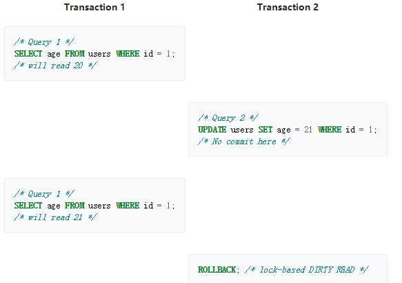

But in this case no row exists that has an id of 1 and an age of 21.

#### Non-repeatable reads

A non-repeatable read occurs, when during the course of a transaction, a row is retrieved twice and the values within the row differ between reads.

Non-repeatable reads phenomenon may occur in a lock-based concurrency control method when read locks are not acquired when performing a SELECT, or when the acquired locks on affected rows are released as soon as the SELECT operation is performed. Under the multiversion concurrency control method, non-repeatable reads may occur when the requirement that a transaction affected by a commit conflict must roll back is relaxed.

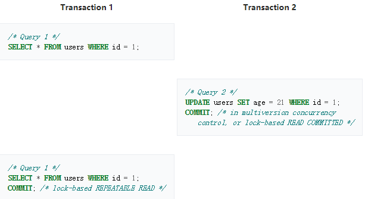

In this example, Transaction 2 commits successfully, which means that its changes to the row with id 1 should become visible. However, Transaction 1 has already seen a different value for age in that row. At the SERIALIZABLE and REPEATABLE READ isolation levels, the DBMS must return the old value for the second SELECT. At READ COMMITTED and READ UNCOMMITTED, the DBMS may return the updated value; this is a non-repeatable read.

There are two basic strategies used to prevent non-repeatable reads. The first is to delay the execution of Transaction 2 until Transaction 1 has committed or rolled back. This method is used when locking is used, and produces the serial schedule T1, T2. A serial schedule exhibits repeatable reads behaviour.

In the other strategy, as used in multiversion concurrency control, Transaction 2 is permitted to commit first, which provides for better concurrency. However, Transaction 1, which commenced prior to Transaction 2, must continue to operate on a past version of the database — a snapshot of the moment it was started. When Transaction 1 eventually tries to commit, the DBMS checks if the result of committing Transaction 1 would be equivalent to the schedule T1, T2. If it is, then Transaction 1 can proceed. If it cannot be seen to be equivalent, however, Transaction 1 must roll back with a serialization failure.

Using a lock-based concurrency control method, at the REPEATABLE READ isolation mode, the row with ID = 1 would be locked, thus blocking Query 2 until the first transaction was committed or rolled back. In READ COMMITTED mode, the second time Query 1 was executed, the age would have changed.

Under multiversion concurrency control, at the SERIALIZABLE isolation level, both SELECT queries see a snapshot of the database taken at the start of Transaction 1. Therefore, they return the same data. However, if Transaction 1 then attempted to UPDATE that row as well, a serialization failure would occur and Transaction 1 would be forced to roll back.

At the READ COMMITTED isolation level, each query sees a snapshot of the database taken at the start of each query. Therefore, they each see different data for the updated row. No serialization failure is possible in this mode (because no promise of serializability is made), and Transaction 1 will not have to be retried.

#### Phantom reads

A phantom read occurs when, in the course of a transaction, new rows are added by another transaction to the records being read.

This can occur when range locks are not acquired on performing a SELECT ... WHERE operation. The phantom reads anomaly is a special case of Non-repeatable reads when Transaction 1 repeats a ranged SELECT ... WHERE query and, between both operations, Transaction 2 creates (i.e. INSERT) new rows (in the target table) which fulfill that WHERE clause.

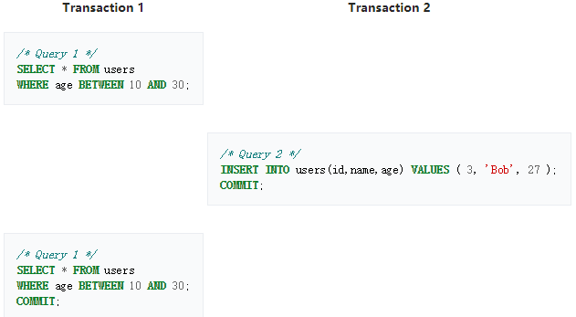

Note that Transaction 1 executed the same query twice. If the highest level of isolation were maintained, the same set of rows should be returned both times, and indeed that is what is mandated to occur in a database operating at the SQL SERIALIZABLE isolation level. However, at the lesser isolation levels, a different set of rows may be returned the second time.

In the SERIALIZABLE isolation mode, Query 1 would result in all records with age in the range 10 to 30 being locked, thus Query 2 would block until the first transaction was committed. In REPEATABLE READ mode, the range would not be locked, allowing the record to be inserted and the second execution of Query 1 to include the new row in its results.

#### Isolation levels
Of the four ACID properties in a DBMS (Database Management System), the isolation property is the one most often relaxed. When attempting to maintain the highest level of isolation, a DBMS usually acquires locks on data which may result in a loss of concurrency or implements multiversion concurrency control. This requires adding logic for the application to function correctly.

Most DBMSs offer a number of transaction isolation levels, which control the degree of locking that occurs when selecting data. For many database applications, the majority of database transactions can be constructed to avoid requiring high isolation levels (e.g. SERIALIZABLE level), thus reducing the locking overhead for the system. The programmer must carefully analyze database access code to ensure that any relaxation of isolation does not cause software bugs that are difficult to find. Conversely, if higher isolation levels are used, the possibility of deadlock is increased, which also requires careful analysis and programming techniques to avoid.

The isolation levels defined by the ANSI/ISO SQL standard are listed as follows.

##### Serializable
This is the highest isolation level.

With a lock-based concurrency control DBMS implementation, serializability requires read and write locks (acquired on selected data) to be released at the end of the transaction. Also range-locks must be acquired when a SELECT query uses a ranged WHERE clause, especially to avoid the phantom reads phenomenon.

When using non-lock based concurrency control, no locks are acquired; however, if the system detects a write collision among several concurrent transactions, only one of them is allowed to commit. See snapshot isolation for more details on this topic.

From : (Second Informal Review Draft) ISO/IEC 9075:1992, Database Language SQL- July 30, 1992: The execution of concurrent SQL-transactions at isolation level SERIALIZABLE is guaranteed to be serializable. A serializable execution is defined to be an execution of the operations of concurrently executing SQL-transactions that produces the same effect as some serial execution of those same SQL-transactions. A serial execution is one in which each SQL-transaction executes to completion before the next SQL-transaction begins.

##### Repeatable reads
In this isolation level, a lock-based concurrency control DBMS implementation keeps read and write locks (acquired on selected data) until the end of the transaction. However, range-locks are not managed, so phantom reads can occur.

Write skew is possible at this isolation level, a phenomenon where two writes are allowed to the same column(s) in a table by two different writers (who have previously read the columns they are updating), resulting in the column having data that is a mix of the two transactions.[3][4]

##### Read committed
In this isolation level, a lock-based concurrency control DBMS implementation keeps write locks (acquired on selected data) until the end of the transaction, but read locks are released as soon as the SELECT operation is performed (so the non-repeatable reads phenomenon can occur in this isolation level). As in the previous level, range-locks are not managed.

Putting it in simpler words, read committed is an isolation level that guarantees that any data read is committed at the moment it is read. It simply restricts the reader from seeing any intermediate, uncommitted, 'dirty' read. It makes no promise whatsoever that if the transaction re-issues the read, it will find the same data; data is free to change after it is read.

##### Read uncommitted
This is the lowest isolation level. In this level, dirty reads are allowed, so one transaction may see not-yet-committed changes made by other transactions.

Since each isolation level is stronger than those below, in that no higher isolation level allows an action forbidden by a lower one, the standard permits a DBMS to run a transaction at an isolation level stronger than that requested (e.g., a "Read committed" transaction may actually be performed at a "Repeatable read" isolation level).

#### Default isolation level
The default isolation level of different DBMS's varies quite widely. Most databases that feature transactions allow the user to set any isolation level. Some DBMS's also require additional syntax when performing a SELECT statement to acquire locks (e.g. SELECT ... FOR UPDATE to acquire exclusive write locks on accessed rows).

However, the definitions above have been criticized as being ambiguous, and as not accurately reflecting the isolation provided by many databases:

This paper shows a number of weaknesses in the anomaly approach to defining isolation levels. The three ANSI phenomena are ambiguous, and even in their loosest interpretations do not exclude some anomalous behavior ... This leads to some counter-intuitive results. In particular, lock-based isolation levels have different characteristics than their ANSI equivalents. This is disconcerting because commercial database systems typically use locking implementations. Additionally, the ANSI phenomena do not distinguish between a number of types of isolation level behavior that are popular in commercial systems.[5]
There are also other criticisms concerning ANSI SQL's isolation definition, in that it encourages implementors to do "bad things":

... it relies in subtle ways on an assumption that a locking schema is used for concurrency control, as opposed to an optimistic or multi-version concurrency scheme. This implies that the proposed semantics are ill-defined.[6]

#### Isolation levels, read phenomena, and locks
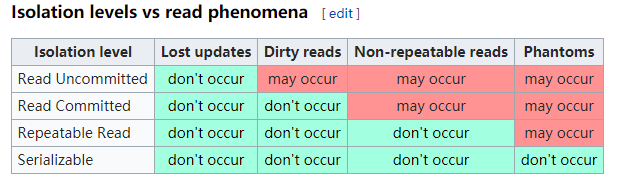

Anomaly Serializable is not the same as Serializable. That is, it is necessary, but not sufficient that a Serializable schedule should be free of all three phenomena types.[5]

- [Isolation (database systems)](https://en.wikipedia.org/wiki/Isolation_(database_systems))

### deep in the transaction isolation implementation 

Below snapshot comeing from below link : 
-[deep-into-isolation-levels](https://www.slideshare.net/brshristov/deep-into-isolation-levels)

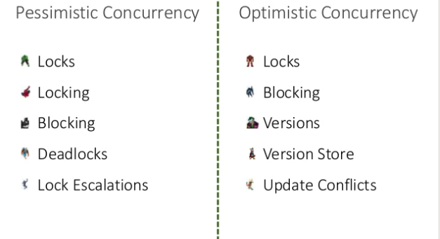
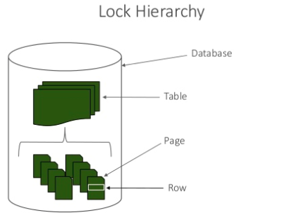
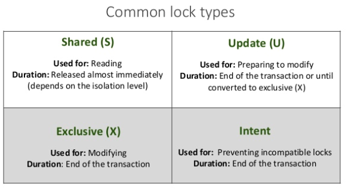
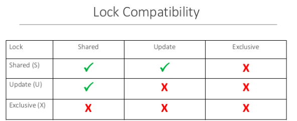
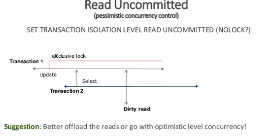
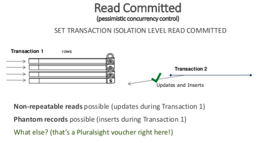
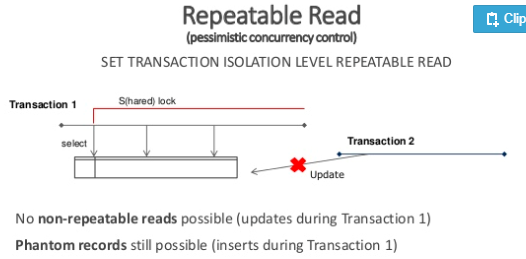
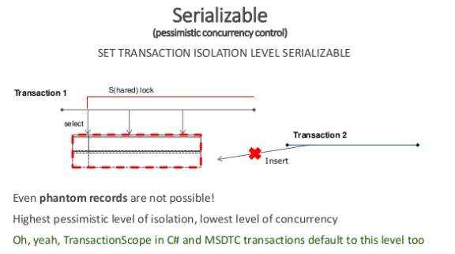
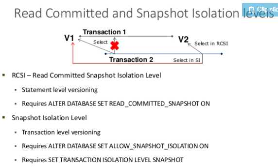

### MVVC (TODO)

